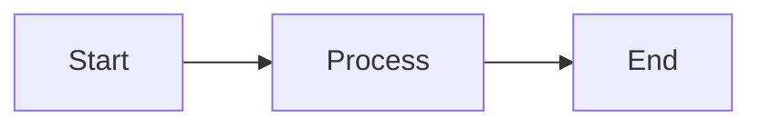

# AI Techs - VuePress Blog

A VuePress blog with support for KaTeX, Markdown, and Mermaid diagrams.

## Features

- **Markdown Support**: Write your blog posts in easy-to-use Markdown format
- **KaTeX Integration**: Render mathematical equations beautifully
- **Mermaid Diagrams**: Create diagrams and flowcharts using Mermaid syntax
- **GitHub Pages**: Automatic deployment to GitHub Pages

## Project Structure

```
docs/
├── .vuepress/
│   └── config.ts          # VuePress configuration
├── aitechs/                # Top folder (base path)
│   ├── README.md           # Homepage
│   └── blog/
│       ├── README.md       # Blog index
│       └── first-post.md   # Sample blog post
```

## Development

### Prerequisites

- Node.js (v20 or higher)
- npm

### Setup

1. Install dependencies:
   ```bash
   npm install
   ```

2. Start development server:
   ```bash
   npm run docs:dev
   ```

3. Build for production:
   ```bash
   npm run docs:build
   ```

## Writing Blog Posts

Create new markdown files in the `docs/aitechs/blog/` directory.

### KaTeX Example

Inline math: `$E = mc^2$`

Block math:
```
$$
\int_{-\infty}^{\infty} e^{-x^2} dx = \sqrt{\pi}
$$
```

### Mermaid Example



## Deployment

The site is automatically deployed to GitHub Pages when you push to the main/master branch.

The deployment workflow is configured in `.github/workflows/deploy.yml`.

## Configuration

- Base path: `/aitechs/`
- Theme: VuePress default theme
- Plugins:
  - `@vuepress/plugin-markdown-math` (KaTeX support)
  - `vuepress-plugin-mermaidjs-next` (Mermaid support)

## License

ISC