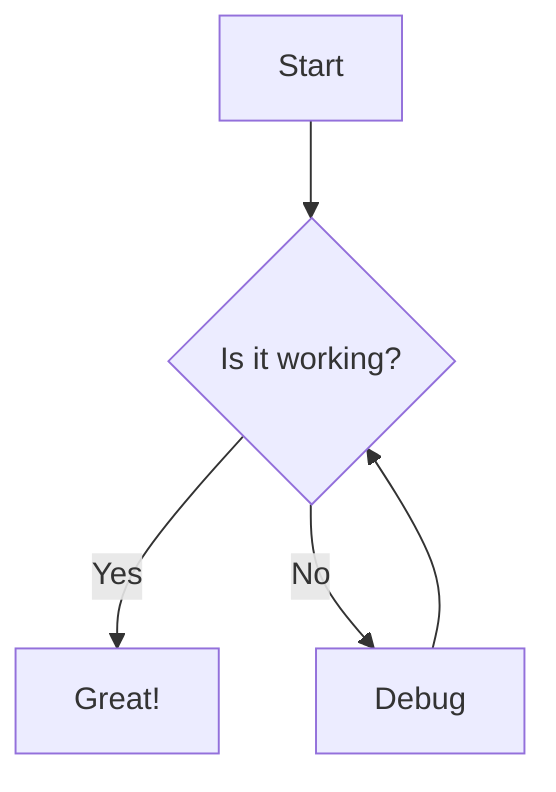
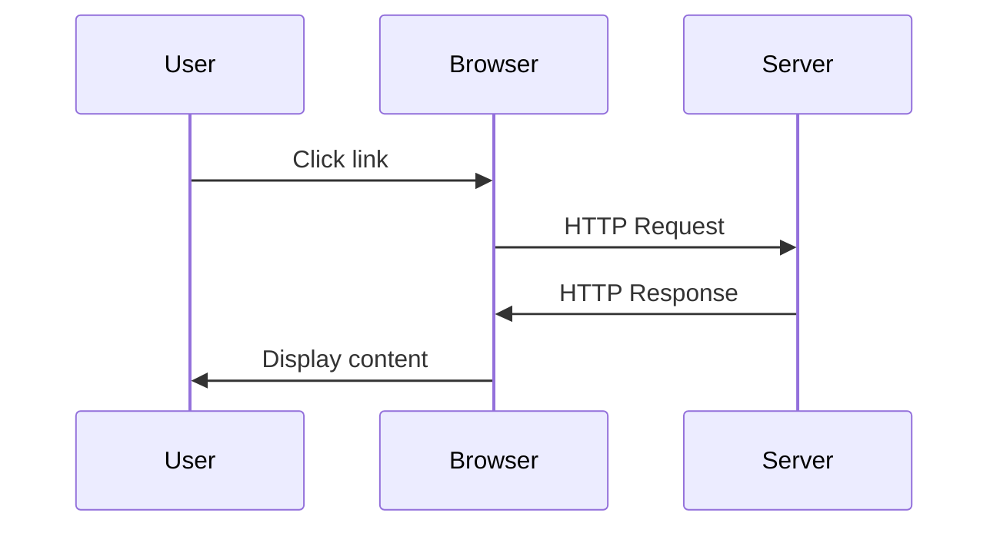
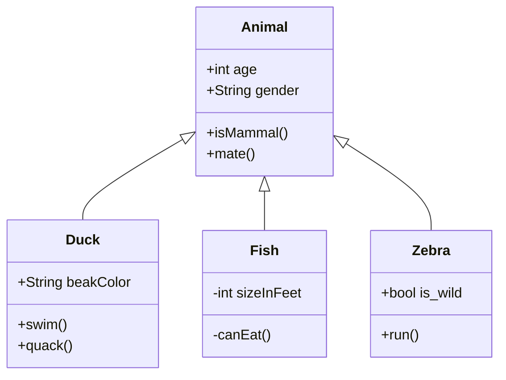

# Getting Started with VuePress

Welcome to our first blog post! This post demonstrates the various features of our VuePress blog.

## Markdown Features

VuePress supports all standard Markdown syntax. Here are some examples:

### Text Formatting

**Bold text** and *italic text* are supported.

You can also create lists:

- Item 1
- Item 2
- Item 3

And numbered lists:

1. First item
2. Second item
3. Third item

### Code Blocks

Inline `code` looks like this.

```javascript
// Code blocks with syntax highlighting
function greet(name) {
  console.log(`Hello, ${name}!`);
}

greet('VuePress');
```

## Mathematical Equations with KaTeX

VuePress supports mathematical equations using KaTeX syntax.

### Inline Math

You can write inline equations like $E = mc^2$ or $a^2 + b^2 = c^2$.

### Block Math

You can also create block equations:

$$
\int_{-\infty}^{\infty} e^{-x^2} dx = \sqrt{\pi}
$$

Here's another example:

$$
f(x) = \begin{cases}
x^2 & \text{if } x \geq 0 \\
-x^2 & \text{if } x < 0
\end{cases}
$$

## Diagrams with Mermaid

Mermaid allows you to create diagrams using simple text syntax.

### Flowchart



### Sequence Diagram



### Class Diagram



## Conclusion

VuePress is a powerful static site generator that makes it easy to create documentation and blogs with:

- Full Markdown support
- Mathematical equations with KaTeX
- Diagrams with Mermaid
- Vue-powered components

Start writing your own blog posts and enjoy the features!

---

*Published on: 2024-01-01*